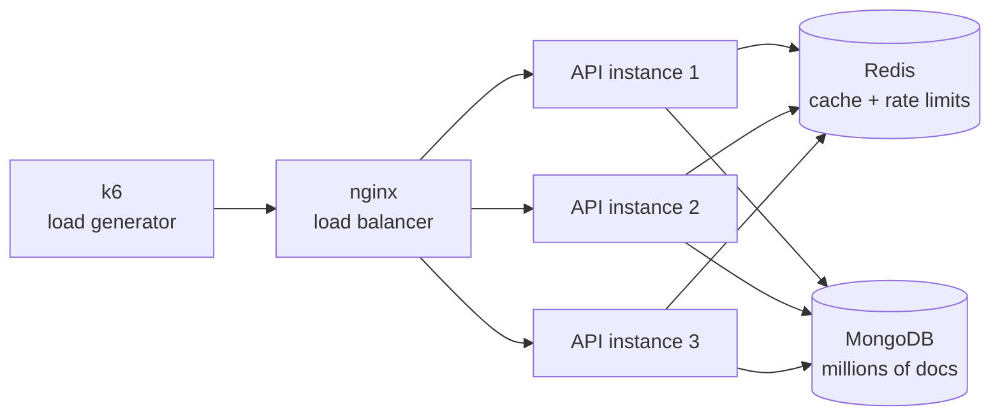

# Load Bearing

> An Express + MongoDB API seeded with millions of records to benchmark pagination, indexing, caching, rate limiting and load balancing with k6.

**Load Bearing** is a hands-on scaling lab. Each feature is built the naive way first, pushed until it breaks under load, then fixed, and the fix is proven with before/after k6 numbers. No claim goes in this README without a measurement behind it.

---

## Why this exists

Pagination, caching and load balancing are easy to "learn" on 20 rows, where none of them matter. This project uses a dataset big enough that the naive version actually hurts, so every optimization has a visible, measurable payoff.

## Stack

| Layer | Choice |
|---|---|
| API | Node.js + Express |
| Database | MongoDB (native driver, single-node replica set) |
| Cache / rate limiting | Redis |
| Load balancer | nginx or ELB AWS service |
| Seed data | `@faker-js/faker` |
| Load testing | k6 |
| Correctness tests | Postman / Newman |
| Orchestration | Docker Compose |

The native MongoDB driver is used on purpose instead of Mongoose: the point is to see exactly which queries hit the database.

## Architecture



API instances are **stateless**: anything shared (cache, rate-limit counters) lives in Redis so any instance can serve any request.

## Getting started

**Prerequisites:** Docker and Docker Compose.

```bash
git clone https://github.com/<your-username>/load-bearing.git
cd load-bearing
cp .env.example .env

docker compose up -d            # API, MongoDB, Redis, nginx
docker compose exec api npm run seed   # seed the database (takes a few minutes)
```

The API is available at `http://localhost:3000` (single instance) or `http://localhost:8080` (through nginx).

### Run a load test

```bash
docker compose run --rm k6 run /scripts/pagination-offset.js
docker compose run --rm k6 run /scripts/pagination-cursor.js
```

## Data model

Seeded e-commerce data, chosen because it has real relationships and realistic query patterns:

| Collection | Approx. size | Notes |
|---|---|---|
| `users` | 500k | |
| `products` | 1M | category, price, rating, createdAt |
| `orders` | 2M | references users and products |
| `reviews` | 3M | referenced from products (not embedded) |

Seeding uses batched `insertMany` (10k docs per batch, `ordered: false`).

## API

| Method | Endpoint | Description |
|---|---|---|
| GET | `/health` | Liveness check used by nginx |
| GET | `/products?page=&limit=` | Offset pagination (naive) |
| GET | `/products?after=&limit=` | Cursor (keyset) pagination |
| GET | `/products?category=&sort=price` | Filtering + sorting |
| GET | `/products/:id` | Single product (cached) |
| GET | `/users/:id/orders` | A user's orders, paginated |

## Experiments

Each experiment follows the same loop: **baseline → change one thing → re-measure → record the result.**

- [ ] **1. Pagination**: `skip/limit` vs. keyset pagination on `_id`, plus a compound cursor (`price` + `_id`) for non-unique sort keys
- [ ] **2. Indexing**: compound indexes using the ESR rule (Equality, Sort, Range), verified with `.explain("executionStats")`
- [ ] **3. Counting**: exact `countDocuments()` vs. estimated vs. cached totals vs. "has next page" only
- [ ] **4. Caching**: Redis cache-aside on hot endpoints, then invalidation on writes
- [ ] **5. Rate limiting**: token bucket in Redis, returning `429` with `Retry-After`
- [ ] **6. Load balancing**: 1 vs. 3 instances behind nginx; round robin vs. least connections
- [ ] **7. Resilience**: health checks, graceful shutdown, connection pool tuning

## Results

Numbers are p95 latency unless noted. Filled in as each experiment is completed.

| Experiment | Before | After | Notes |
|---|---|---|---|
| Deep-page pagination (page 5,000) | TBD | TBD | |
| Filter + sort query | TBD | TBD | |
| Product detail (cached) | TBD | TBD | |
| Throughput: 1 → 3 instances | TBD | TBD | requests/sec |

### Methodology

- Load profiles and thresholds live in `k6/` and are version-controlled.
- **p95** is the headline metric: averages hide the slow requests users actually feel.
- Everything runs on one machine, so absolute numbers are less meaningful than **relative** changes. Test conditions stay the same between before/after runs.

## Project structure

```
load-bearing/
├── docker-compose.yml
├── nginx/nginx.conf
├── src/
│   ├── app.js
│   ├── db.js
│   ├── routes/
│   └── middleware/        # cache, rate limiter
├── scripts/seed.js
├── k6/                    # load test scripts
├── postman/               # Newman correctness tests
└── docs/notes.md          # what I learned, per experiment
```
